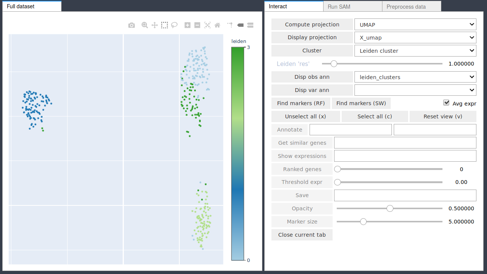

[](https://travis-ci.com/atarashansky/self-assembling-manifold)

# self-assembling-manifold -- SAM version 0.7.5
The Self-Assembling-Manifold (SAM) algorithm.

# SAM is now on Scanpy!
https://github.com/theislab/scanpy

```
import scanpy as sc
import scanpy.external as sce

#returns the SAM object if `inplace=True` and (SAM,AnnData) otherwise
sam = sce.tl.sam(adata, inplace=True) #adata is your AnnData object
```

## Requirements
 - `numpy`
 - `scipy`
 - `pandas`
 - `scikit-learn`
 - `umap-learn`
 - `numba`
 - `anndata`

### Optional dependencies
 - Interactive GUI (Jupyter notebooks)
   - `plotly==4.0.0`
   - `ipythonwidgets`
   - `jupyter`
   - `colorlover`
   - `ipyevents`
 
 - Plots
   - `matplotlib`

 - Clustering
   - `louvain`
   - `leidenalg`
   - `hdbscan`
   - `cython`

 - `scanpy`

## Changelog notes 0.7.0
Converted SAM to have package structure as oppposed to global modules. Imports change as follows:

```
from samalg import SAM
from samalg.gui import SAMGUI
import samalg.utilities as ut
```

## Changelog notes 0.6.17
I added a `sparse_pca` argument to `sam.run`. Setting it to `True` will use an implementation of PCA that can accept sparse inputs, thus allowing us to not need to create a temporary dense copy of the data. This allows for improved scalability to massive datasets.

## Changelog notes 0.6.12
I removed the `sam.save` and `sam.load` pickling functions because it is difficult to unpickle the AnnData objects if the AnnData version used changes. Now, I instead store the raw data in `sam.adata.raw` when saving using `sam.save_anndata`. The raw and filtered data can be loaded from the resulting file using `sam.load_data`.

## Installation
SAM has been most extensively tested using python3.6 but presumably should work on python>=3.6. Python can be installed using Anaconda.

Download Anacodna from here:
    https://www.anaconda.com/download/

Create and activate a new environment with python3.6 as follows:
```
conda create -n environment_name python=3.6
conda activate environment_name
```

Having activated the environment, SAM can be downloaded from the PyPI repository using pip or, for the development version, downloaded from the github directly.

PIP install:
```
pip install sam-algorithm
```

Development version install:
```
git clone https://github.com/atarashansky/self-assembling-manifold.git
cd self-assembling-manifold
python setup.py install
```
For plotting, install `matplotlib`:

```
pip install matplotlib
```

For interactive data exploration (in the `SAMGUI.py` module), `jupyter`, `ipythonwidgets`, `colorlover`, `ipyevents`, and `plotly` are required. Install them in the previously made environment like so:

```
conda install -c conda-forge -c plotly jupyter ipywidgets plotly=4.0.0 colorlover ipyevents
```

### Enabling the SAM GUI in JupyterLab

If you use Jupyter Notebooks, these steps are not needed. If you would like to be able to run SAMGUI in JupyterLab, please do the following:

First install nodejs with:
`conda install nodejs`

To enable ipythonwidgets in Jupyter lab, please run the following:
```
jupyter labextension install @jupyter-widgets/jupyterlab-manager@1.0 --no-build
jupyter labextension install plotlywidget@1.1.0 --no-build
jupyter labextension install jupyterlab-plotly@1.1.0 --no-build
jupyter lab build
```

SAMGUI should now work in JupyterLab.

## Running the SAM GUI

The SAM GUI interface can be run in Jupyer notebooks with the following:

```
from samalg.gui import SAMGUI
sam_gui = SAMGUI(sam) # sam is your SAM object
sam_gui.SamPlot
```
Please see the plotting tutorial for more information about the GUI interface.



## Tutorial
Please see the Jupyter notebooks in the 'tutorial' folder for basic tutorials. If you installed a fresh environment, do not forget to install jupyter into that environment! Please run
```
pip install jupyter
```
in your conda environment. The tutorial assumes that all optional dependencies are installed.

# Basic usage

There are a number of different ways to load data into the SAM object. 

## Using the SAM constructor
### Using preloaded scipy.sparse or numpy expression matrix, gene IDs, and cell IDs:
```
from samalg import SAM #import SAM
sam=SAM(counts=(matrix,geneIDs,cellIDs))
sam.preprocess_data() # log transforms and filters the data
sam.run() #run with default parameters
sam.scatter()
```
### Using preloaded pandas.DataFrame (cells x genes):
```
from samalg import SAM #import SAM
sam=SAM(counts=dataframe)
sam.preprocess_data() # log transforms and filters the data
sam.run() #run with default parameters
sam.scatter()
```

### Using an existing AnnData object:
```
from samalg import SAM #import SAM
sam=SAM(counts=adata)
sam.preprocess_data() # log transforms and filters the data
sam.run() #run with default parameters
sam.scatter()
```

## Using the `load_data` function
### Loading data from a tabular file (e.g. csv or txt):
```
from samalg import SAM #import SAM
sam=SAM() #initialize SAM object
sam.load_data('/path/to/expression_data_file.csv') #load data from a csv file
#sam.load_data('/path/to/expression_data_file.txt', sep='\t') #load data from a txt file with tab delimiters
sam.preprocess_data() # log transforms and filters the data
sam.load_annotations('/path/to/annotations_file.csv')
sam.run()
sam.scatter()
```
### Loading an existing AnnData `h5ad` file: 

If loading tabular data (e.g. from a `csv`), `load_data` by default saves the sparse data structure to a `h5ad` file in the same location as the tabular file for faster loading in subsequent analyses. This file can be loaded as:

```
from samalg import SAM #import SAM
sam=SAM() #initialize SAM object
sam.load_data('/path/to/h5ad_file.h5ad') #load data from a h5ad file
sam.preprocess_data() # log transforms and filters the data
sam.run()
sam.scatter()
```

### Saving/Loading SAM
If you wish to save the SAM outputs and raw and filtered data, you can write `sam.adata` to a `h5ad` file as follows:
`sam.save_anndata(filename)`.

You can load this data back with `sam.load_data`:
`sam.load_data(filename)`

## Citation
If using the SAM algorithm, please cite the following eLife paper:
https://elifesciences.org/articles/48994

```
Tarashansky, A. J. et al. Self-assembling manifolds in single-cell RNA sequencing data. eLife 8, e48994 (2019).
```

## Adding extra functionality
As always, please submit a new issue if you would like to see any functionalities / convenience functions / etc added.
